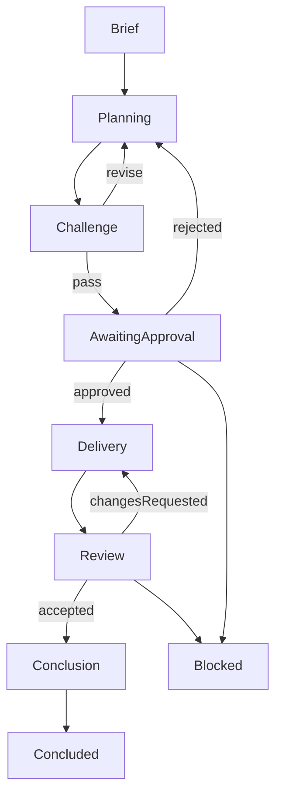

# Workflow multiagente

## Regra zero

1. Uma sessão começa por artefato, não por memória de chat.
2. `[FATO]`, `[HIPÓTESE]`, `[DECISÃO]`, `[RISCO]` e `[PERGUNTA]` não são
   intercambiáveis.
3. Nenhum trabalho de execução começa sem plano, challenge e approval humana em
   arquivo.
4. Quem produz não revisa nem conclui a própria entrega.
5. Gate humano pendente é estado válido de bloqueio, não uma aprovação tácita.
6. A automação nunca pode decidir produto, arquitetura ou aprovação em nome de
   uma pessoa.

## Fluxo

## Fases e autoridade

### `brief`

**Owner:** `Orchestrator`, com contribuição de `Research/Product`.

**Entrada:** pedido, contexto canônico e fontes disponíveis.

**Saída:** `brief.md` com objetivo, limites, classificação de afirmações,
trilha proposta e riscos.

**Avanço permitido:** `Orchestrator` cria ou atualiza o plano e move para
`planning`.

### `planning`

**Owner:** `Orchestrator`.

**Entrada:** brief válido e baseline declarado.

**Saída:** `plan.md`, task sheets quando necessárias, owners, dependências,
allowlists e perfil de verificação.

**Avanço permitido:** `Orchestrator` entrega o plano ao `Challenger` e move para
`challenge`.

### `challenge`

**Owner:** `Challenger`.

**Entrada:** brief e plano da mesma revisão.

**Saída:** `challenge.md` com veredito `pass`, `revise` ou `block`.

**Avanço permitido:** `Challenger` devolve para `planning` quando houver achado
relevante. Com `pass`, encaminha o pacote para `awaiting-approval`.

### `awaiting-approval`

**Owner:** humano responsável pela decisão.

**Entrada:** brief, plano, challenge e riscos da mesma revisão.

**Saída:** artefato em `approvals/` com escopo, revisão, aprovador e gates
restantes.

**Avanço permitido:** somente o approval explícito move a sessão para
`delivery`. Um approval com condições só avança quando todas as condições
marcadas como pré-delivery estiverem resolvidas e verificadas pelo
`Orchestrator`; as demais condições devem ser registradas como gates com owner
e fase de avaliação. Rejeição ou alteração de escopo devolve para `planning`.

### `delivery`

**Owner:** `Research/Product`, `Modeling/Architecture` ou `Delivery`, conforme
a task sheet.

**Entrada:** approval válida e tarefas pendentes com owner único.

**Saída:** evidências e artefatos descritos nas tarefas, sem mudança silenciosa
de escopo.

**Avanço permitido:** quando todas as tarefas estiverem concluídas e o estado
for reconciliado, o `Orchestrator` encaminha para `review`.

### `review`

**Owner:** `Reviewer` independente.

**Entrada:** baseline, artefatos de entrega, evidências e approval.

**Saída:** um `reviews/review.md` com os dois eixos, cada um com resultado e
bloqueios.

**Avanço permitido:** bloqueio ou pedido de ajuste devolve para `delivery`;
aceite nos dois eixos encaminha para `conclusion`.

### `conclusion`

**Owner:** `Concluder` independente.

**Entrada:** revisão aceita e estado de sessão reconciliado.

**Saída:** `conclusion.md` com resultados, mudanças de hipótese, riscos,
próximo passo e destino dos aprendizados.

**Avanço permitido:** `Concluder` propõe o estado final depois de registrar o
destino de cada aprendizado e confirmar que não há gate humano pendente. O
`Orchestrator` é a única autoridade que persiste essa transição em
`session.yaml`: usa `concluded` somente depois de validar a proposal; mantém
`blocked` se um gate continuar necessário até ser resolvido ou transferido para
uma sessão de continuidade já aprovada.

## Estado bloqueado

`blocked` deve declarar a razão, owner do desbloqueio, evidência já disponível e
a ação que reabre a sessão. Não use `concluded` para esconder falta de approval,
evidência ou revisão.

## Handoffs

Todo handoff propõe uma atualização para `session.yaml` com fase, revisão,
owner atual, tarefas pendentes, evidências novas, risks e gates humanos. Somente
o `Orchestrator` persiste essa atualização após validar o handoff. Cada gate
humano precisa registrar approval de origem, revisão, condição, owner, fase de
avaliação, estado e evidência de resolução. Quem recebe deve validar:

1. os arquivos referenciados existem;
2. todos pertencem à mesma revisão;
3. as dependências declaradas foram satisfeitas;
4. nenhum gate obrigatório foi omitido;
5. o estado não conflita com outro owner ou tarefa ativa.

Falha nesses itens devolve a sessão ao papel que emitiu o handoff.

## Autonomia e interrupção

Após approval, agentes podem executar tarefas já cobertas pelo plano, pesquisar,
escrever documentação, executar verificações locais e corrigir incoerências
locais. Devem voltar ao humano para:

- escolher ou alterar problema, público, escopo ou hipótese;
- aceitar um risco material ou waiver de gate;
- aprovar uma decisão arquitetural ou um ADR;
- integrar serviços externos, credenciais, custos, dados compartilhados, Git
  remoto, PR, merge, deploy ou ação irreversível;
- ampliar a allowlist de uma task.

## Relação com os contratos

Os campos e proibições de cada artefato são definidos em
[`artifact-contracts.md`](artifact-contracts.md). As trilhas de cerimônia estão
em [`tracks.md`](tracks.md), os papéis em [`roles.md`](roles.md) e as regras de
paralelismo em [`concurrency.md`](concurrency.md).
