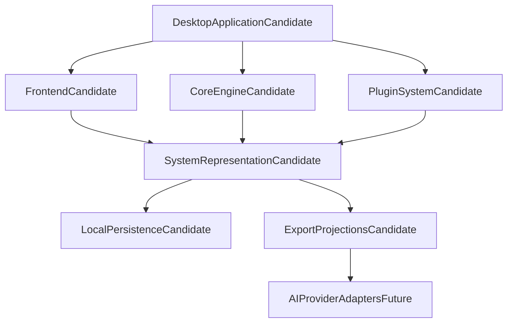
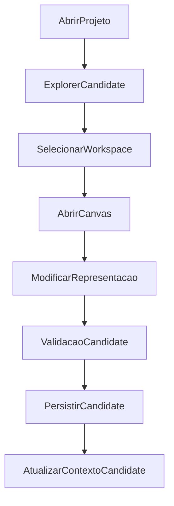
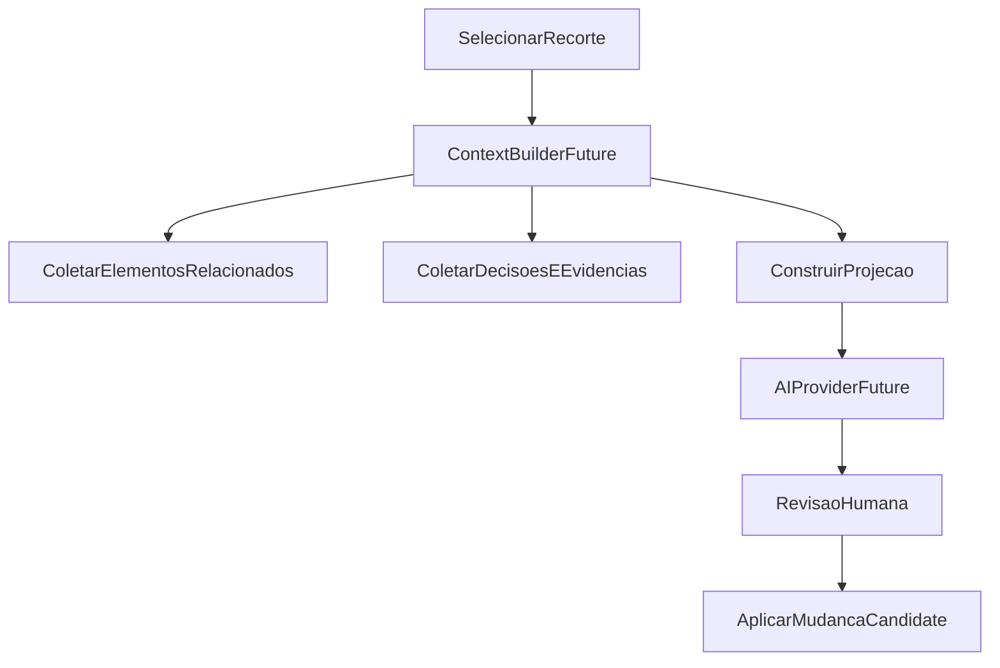
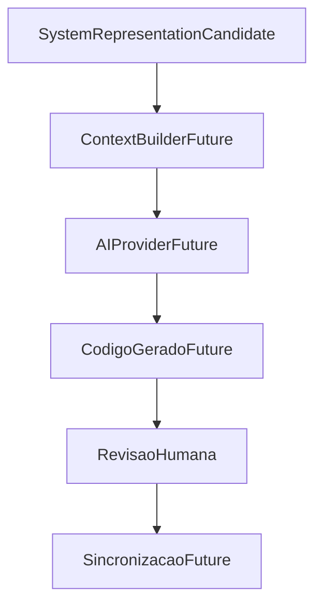
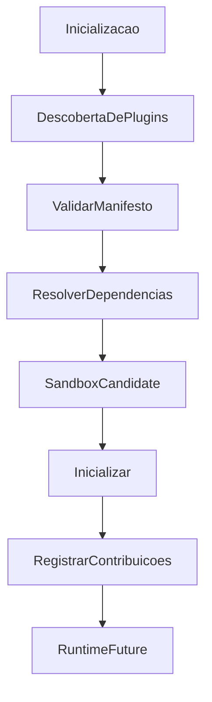
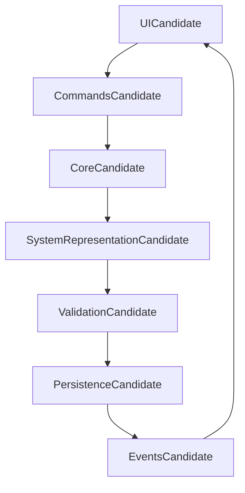

# Contexto técnico proposto

## Status

Discovery. Este documento organiza uma direção técnica candidata para agentes e
pessoas. Nenhuma tecnologia, camada, fluxo ou fronteira abaixo é uma decisão
aceita. A seleção exige requisito, alternativa, experimento ou ADR aprovado.

## Princípios candidatos

- local-first e offline-first quando possível;
- desktop multiplataforma;
- modularidade, extensibilidade e Core pequeno;
- independência de provedor de IA e de linguagem;
- open source e dados de projeto sob controle da pessoa usuária;
- modelos explícitos, comportamento rastreável e projeções derivadas.

## Arquitetura conceitual



O diagrama comunica separação de responsabilidades pretendida. Não prova que
desktop, plugins, persistência local ou adaptadores de IA são necessários à POC.

## Tecnologias sob avaliação

### Runtime desktop: Tauri 2

**Proposta:** usar Tauri 2 para empacotamento, janela nativa, IPC, filesystem,
integração com sistema operacional, segurança e desempenho.

**Alternativas ainda abertas:** web app local, Electron ou outro runtime desktop.

**Pergunta de validação:** quais requisitos de privacidade, offline, filesystem,
distribuição e desempenho tornam desktop necessário ao primeiro público?

### Camada nativa: Rust

**Proposta:** usar Rust em um Core candidato para comandos, persistência,
operações de grafo, APIs nativas, tarefas de fundo e futuros parsers.

**Princípio proposto:** UI não deve viver nessa camada; a fronteira só será
adotada se houver necessidade mensurável de isolamento, desempenho ou acesso
nativo.

**Alternativas ainda abertas:** Core em TypeScript, bibliotecas especializadas,
WASM ou outro runtime.

### Frontend: React e TypeScript

**Proposta:** React/TypeScript por ecossistema, maturidade e possíveis
integrações com canvas, editor, comandos e docking.

**Pergunta de validação:** a experiência de modelagem requer componentes
interativos que justifiquem esse ecossistema, ou uma camada menor atende a POC?

### Canvas, editor e estado

- **React Flow:** candidato para nós, relações, pan, zoom e visualizações.
- **Monaco:** candidato para specs, prompts, scripts ou futura DSL.
- **Zustand:** candidato para estado local de interface.
- **TanStack Query:** candidato para operações assíncronas ou provedores
  remotos futuros.
- **TanStack Router:** candidato para navegar entre workspaces.

Nenhuma dessas bibliotecas é requisito de produto. Cada uma deve ser comparada
com a menor solução que permita validar a experiência correspondente.

### Persistência e interoperabilidade

**Proposta (alinhada à visão 0.5 / core):**

- **JSON por Scope** = fonte de verdade versionável (git, diff, construção por
  fatia).
- **SQLite local** = índice/cache rebuildável (busca, travessia, contexto pra
  agente, checagens) — **não** commitado como verdade do projeto.

Proposta antiga “SQLite transacional + JSON só backup” fica **rebaixada**:
inverte a autoridade e complica branch/merge. Ver
[`modeling-core-0.5.md`](modeling-core-0.5.md).

**Não decidido:** schema JSON, layout de pastas, quando introduzir SQLite na
POC, migrações, FTS.

## Fluxos conceituais

### Workspace — MVP candidate



### Contexto para IA — future



IA não deve receber prompt isolado quando o produto tiver contexto estruturado,
mas esse comportamento é uma visão futura e não integração da POC.

### Engenharia reversa — future

```mermaid
flowchart TD
    existingProject[ProjetoExistente] --> parser[ParserFuture]
    parser --> ast[ASTCandidate]
    ast --> semantic[AnaliseSemanticaFuture]
    semantic --> representation[SystemRepresentationCandidate]
    representation --> graph[VisualizacaoCandidate]
```

Tree-sitter, LSP e parsers próprios são alternativas de pesquisa, não
dependências selecionadas.

### Geração e revisão de código — future



O objetivo é que código seja uma projeção revisável da representação, não sua
fonte de verdade. A viabilidade de sincronização ainda não foi demonstrada.

### Plugins — future



Plugins podem futuramente contribuir linguagens, frameworks, nós visuais,
generators, providers, exporters, importers, validators, templates e pipelines.
Eles não substituem o Core.

### Runtime interno — POC candidate



A intenção é que a UI proponha comandos e que uma fronteira de Core preserve
invariantes. A forma de IPC e a existência de camada Rust continuam abertas.

## Limites do sistema

### Responsabilidades candidatas

- representação de sistemas e conhecimento de projeto;
- visualização e organização de arquitetura;
- construção de contexto estruturado;
- validação de significado e consistência;
- workspaces e projeções;
- persistência local;
- extensibilidade por plugins.

### Fora da missão

- substituir Git, GitHub, CI/CD ou package managers;
- hospedar aplicações ou gerir infraestrutura cloud;
- tornar-se uma plataforma no-code;
- tornar-se uma IDE de propósito geral.

Esses limites não impedem integrações futuras. Eles impedem que integração seja
confundida com substituição da ferramenta externa.

## Perguntas para promoção técnica

- Que requisito mensurável justifica desktop e local-first?
- Qual operação exige Core separado ou linguagem nativa?
- Qual subconjunto de canvas e inspector agrega valor em experimento?
- Que garantias de persistência, histórico e portabilidade o usuário espera?
- O que deve pertencer ao Core e o que pode ser plugin?
- Qual ameaça torna sandbox ou segurança de plugin necessária?
- MCP resolve integração de forma suficiente para o público validado?
