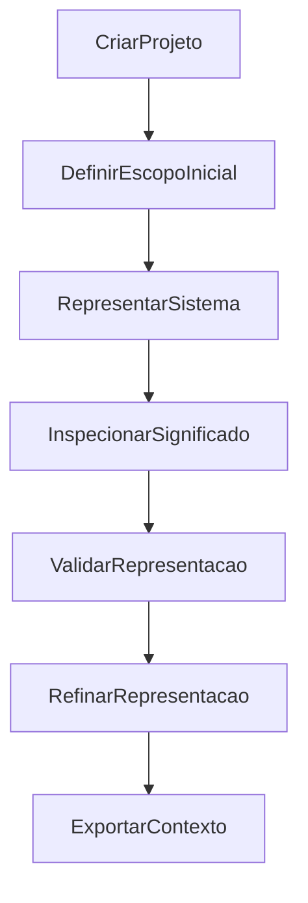

# Mapa de experiências e telas candidatas

## Status

Hipóteses de UX para validar a experiência norteadora. Não definem layout,
componentes visuais, biblioteca ou comportamento implementado.

## Jornada principal candidata

O fluxo não é linear na prática: a pessoa pode voltar do export ou da validação
para refinar a representação. A intenção é tornar esse ciclo visível.

## Tela candidata: criação ou abertura de projeto

**Pergunta de UX:** qual informação mínima permite iniciar sem impor uma
arquitetura?

**Entrada:** nome, intenção ou problema inicial do sistema.

**Ação:** criar ou abrir uma unidade local de conhecimento.

**Saída observável:** projeto com ponto de entrada para uma representação vazia
ou guiada.

**Dependência de modelo:** conceito de Project ainda candidato.

**Validação:** observar se pessoas entendem o primeiro passo sem configurar
stack, framework ou estrutura de código.

## Tela candidata: explorer

**Pergunta de UX:** como navegar por conhecimento sem criar uma árvore que
force taxonomia prematura?

**Entrada:** projeto e elementos já registrados.

**Ação:** selecionar uma visão, elemento, fluxo ou artefato relacionado.

**Saída observável:** contexto selecionado para canvas, inspector ou exportação.

**Dependência de modelo:** Project, View e Element candidatos.

**Validação:** verificar se a pessoa encontra o que criou e entende que uma
mesma representação pode ter múltiplas visões.

## Tela candidata: canvas semântico

**Pergunta de UX:** a visualização ajuda a pensar ou apenas reproduz um
diagrama?

**Entrada:** elementos e relações selecionados no explorer.

**Ação:** criar, conectar, agrupar, navegar e reorganizar elementos.

**Saída observável:** relações visualizadas sem perder significado, fonte ou
restrição.

**Dependência de modelo:** Element, Relationship, Flow e Boundary candidatos.

**Validação:** comparar se a pessoa identifica uma lacuna, responsabilidade ou
dependência que não percebeu em texto isolado.

## Tela candidata: inspector de significado

**Pergunta de UX:** como registrar intenção sem esconder detalhes em nós
visuais?

**Entrada:** elemento, relação ou fluxo selecionado.

**Ação:** editar responsabilidade, regra, restrição, decisão, hipótese ou
evidência vinculada.

**Saída observável:** informação semântica explícita e rastreável.

**Dependência de modelo:** Responsibility, Rule, Decision, Hypothesis, Risk e
Evidence candidatos.

**Validação:** verificar se participantes conseguem explicar por que algo
existe e o que ele deve fazer.

## Tela candidata: feedback de validação

**Pergunta de UX:** que lacuna é útil apontar sem impor uma arquitetura?

**Entrada:** representação selecionada e regras de consistência ainda
provisórias.

**Ação:** revisar achados, navegar para a origem e registrar decisão ou lacuna.

**Saída observável:** feedback explicável, contestável e ligado a um elemento.

**Dependência de modelo:** semântica e invariantes ainda em discovery.

**Validação:** medir se o feedback gera reflexão útil em vez de ruído ou
correção mecânica.

## Tela candidata: exportação de contexto

**Pergunta de UX:** qual recorte de uma representação ajuda outra pessoa ou
agente sem despejar todo o projeto?

**Entrada:** seleção, visão, decisões e evidências relacionadas.

**Ação:** gerar uma projeção portátil de contexto.

**Saída observável:** pacote revisável que identifica fonte, escopo e lacunas.

**Dependência de modelo:** View, Export e proveniência candidatos.

**Validação:** usar em experimento comparativo, não como integração de IA em
produção.

## Workspaces candidatos

Architecture, Domain, Requirements, Testing e AI Workspace são nomes de visões
possíveis sobre uma mesma representação; não são módulos de produto decididos.
Cada workspace deve justificar o valor de visualizar o mesmo conhecimento por
outro recorte antes de entrar no MVP.
